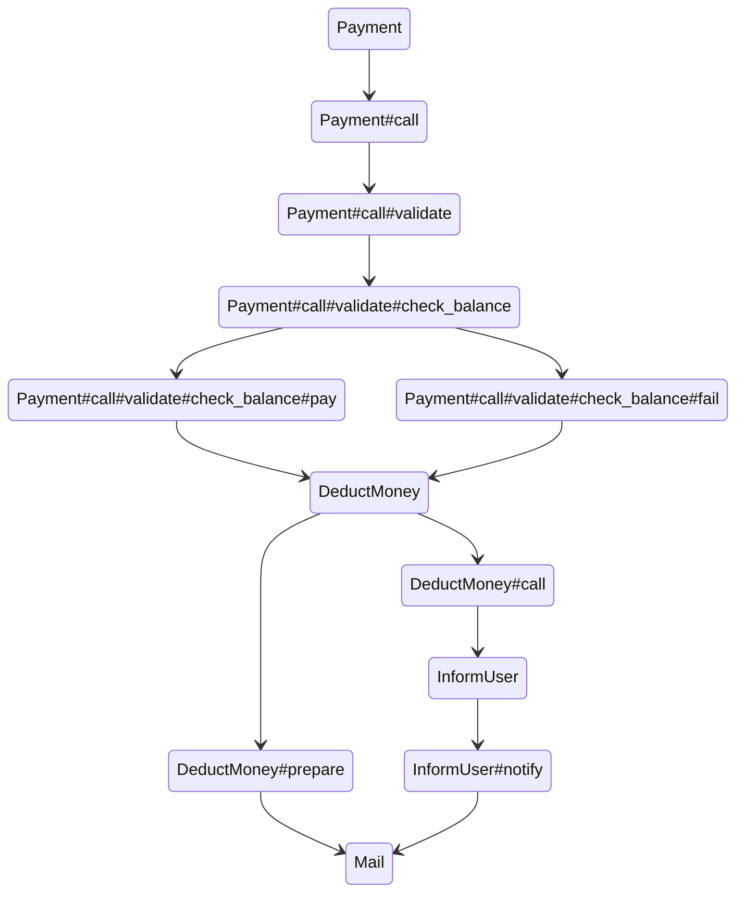

# Damn::Legacy
Quite a lot of time I have to work with huge legacy code bases. When I face a bug I create small ruby script to put everything I've found or related information.
I create small DSL to describe "stacktraces" which I create by hand. Main goal of this gem is provide a nice DSL to create this kind of code mind maps.  
I found it useful for few reasons first one all IDE support code navigation it means I can easely jump to real classes and keep context of the task tight in one file.  
Second benefit this DSL can create diagrams currently it's support only [Mermaid.js](https://mermaid-js.github.io/mermaid/#/stateDiagram) state diagram.  
Good thing about it you can easily visualise it and embed in your document to share it with someone for your own knowledge base.  

I'm trying this thing as POC means if you find it useful it's cool if not whatever :)  

```ruby
Damn::Legacy.turn_on
Damn::Legacy.store_clean

DeductMoney.meth(:prepare).step do
  Mail
end

Payment.meth([call: [validate: [check_balance: [:pay, :fail]]]]).step do
  DeductMoney.meth(:call).step do
    InformUser.meth(:notify).step do
      Mail
    end
  end
end

```
Example


## Installation

Add this line to your application's Gemfile:

```ruby
gem 'damn-legacy'
```

And then execute:

    $ bundle install

Or install it yourself as:

    $ gem install damn-legacy

## Usage

TODO: Write usage instructions here

## Development

After checking out the repo, run `bin/setup` to install dependencies. Then, run `rake spec` to run the tests. You can also run `bin/console` for an interactive prompt that will allow you to experiment.

To install this gem onto your local machine, run `bundle exec rake install`. To release a new version, update the version number in `version.rb`, and then run `bundle exec rake release`, which will create a git tag for the version, push git commits and the created tag, and push the `.gem` file to [rubygems.org](https://rubygems.org).

## Contributing

Bug reports and pull requests are welcome on GitHub at https://github.com/[USERNAME]/damn-legacy. This project is intended to be a safe, welcoming space for collaboration, and contributors are expected to adhere to the [code of conduct](https://github.com/[USERNAME]/damn-legacy/blob/master/CODE_OF_CONDUCT.md).

## License

The gem is available as open source under the terms of the [MIT License](https://opensource.org/licenses/MIT).

## Code of Conduct

Everyone interacting in the Damn::Legacy project's codebases, issue trackers, chat rooms and mailing lists is expected to follow the [code of conduct](https://github.com/[USERNAME]/damn-legacy/blob/master/CODE_OF_CONDUCT.md).
